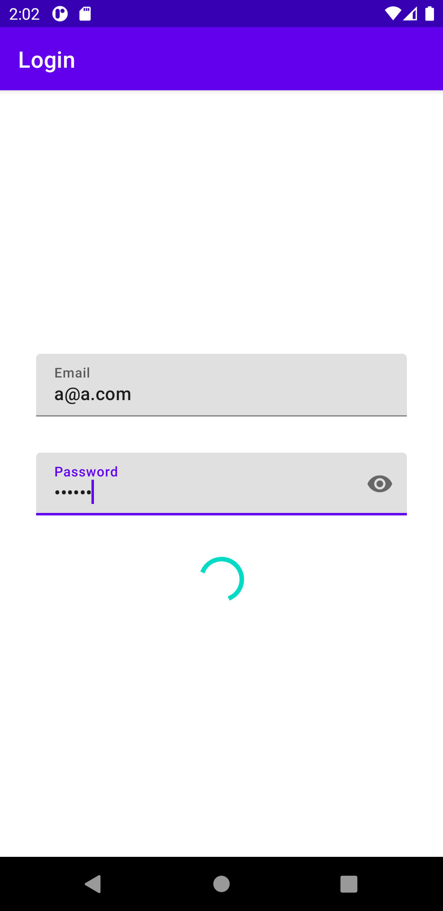
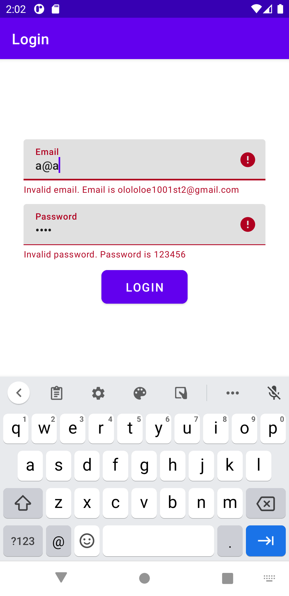
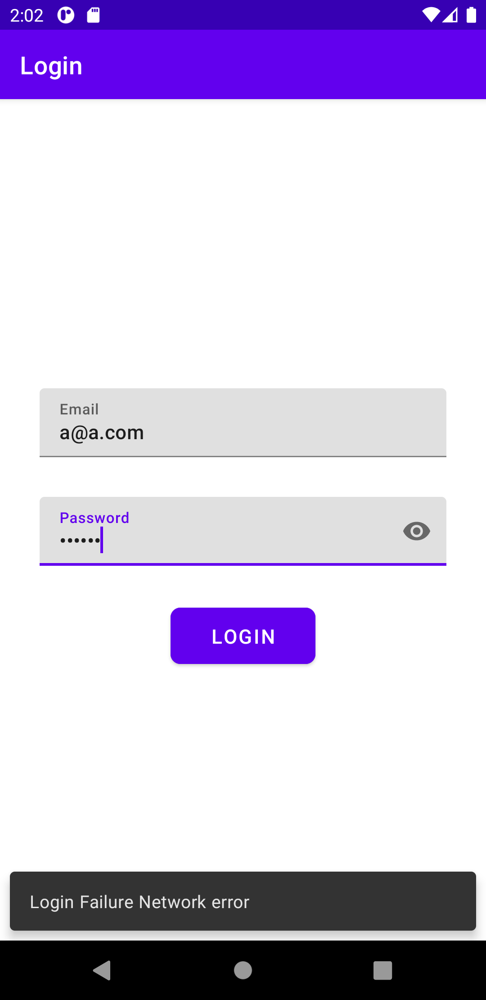

# MVI-Arrow-Coroutines-Flow

## Coroutine + Flow = MVI :heart:
*   Play MVI with Kotlin Coroutines Flow
*   Master branch using Koin for DI

| loading view state | Error view state | fail validate input |
| --------------- | ---------------- | ------------ |
|  |  |  |

